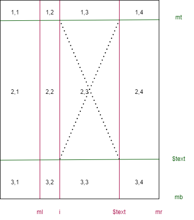
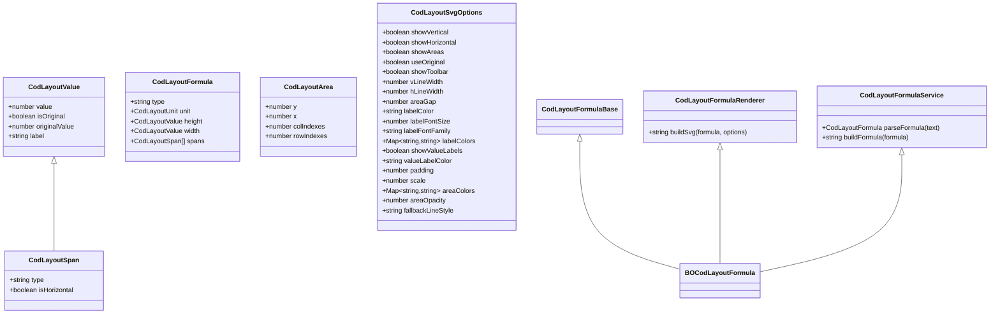
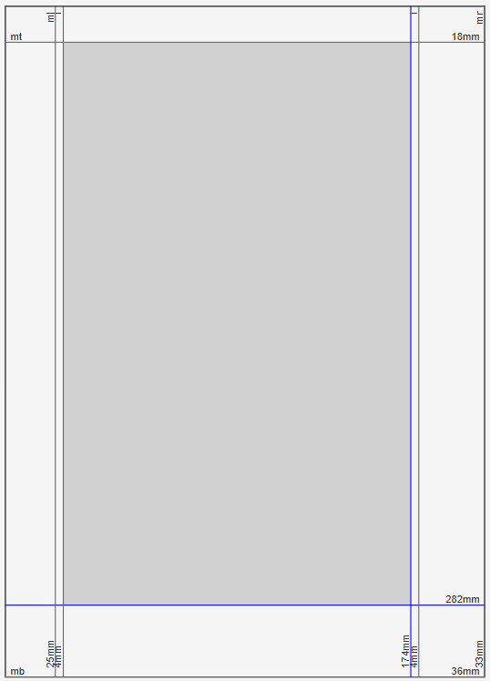

# CodLayoutView

- [CodLayoutView](#codlayoutview)
  - [Model](#model)
  - [Usage](#usage)
  - [Formulas](#formulas)
    - [Itinera (IT)](#itinera-it)
    - [Bianconi-Orsini](#bianconi-orsini)
  - [Dev Workspace Setup](#dev-workspace-setup)
    - [Lite Server](#lite-server)
  - [History](#history)
    - [1.0.0](#100)
    - [0.0.1](#001)

Codicological layout formulas services and view web component in a framework-independent Typescript library. This library contains services and models representing manuscript layout formulas, and is a generalization inspired by [Cadmus codicology layout formulas](https://github.com/vedph/cadmus-codicology-shell/blob/master/projects/myrmidon/cadmus-codicology-ui/src/lib/services/cod-layout.service.ts).

Formulas are text strings which represent in a compact way the size and gridlines of a manuscript page.

In this general model, we have a list of vertical _gridlines_, with the span between each of them, from top to bottom; and a list of horizontal gridlines, with the span between each of them, from left to right.

Once we virtually draw these lines, we get a grid which defines layout _areas_. A specific label tags those areas designed to contain text. Other areas are used for empty areas like margins, or for areas designed for special purposes, like holding initials.

This library provides:

- generic models for codicological layout;
- a layout view custom web component, which can display an interactive view of the layout represented by the formula;
- layout formula services, which can be swapped in the same layout view component.

👉 Quick start for this repository: download or clone the repository, open a terminal in its folder, restore NPM packages (`npm i`), and run with `npm run start`. When started open your browser at <localhost:3000>. The library has no additional dependencies.

- building: `npm run build`.
- running: `npm run start`.
- testing: use VSCode extensions or just `npm run test`.

## Model

All the formulas share the same [model](src/models.ts), which is based on these elements:

- **dimension**: a single numeric value (`CodLayoutValue`): this couples a value with an optional label, and a second optional value representing the original (reconstructed) value. Also, `isOriginal` tells whether the current value also is the original one (which most often is not the case). So, the dimension value can be represented by:
  - a current value equal to the original one (`isOriginal`=true).
  - a current value not equal to the original one, which can't be reconstructed (`isOriginal`=false).
  - a current value not equal to the original one, which can be reconstructed (`isOriginal`=false, `originalValue` specified).
- **size**: a pair of dimensions for the sheet's width and height.
- **span**: a dimension measured from the sheet's edge (top or left) along the horizontal or vertical axis. For instance, on the vertical axis you can get 3 spans: top margin (from sheet's top edge), text, bottom margin. Each is a dimension which gets measured from the previous span or from the sheet's edge. Dimensions along the vertical axis are visually represented by horizontal gridlines, and dimensions along the horizontal axis by vertical gridlines. Spans are dimensions having a direction (horizontal or vertical) and a type (in most cases undefined except when it is `text`, which defines an area designed to contain text).

Consider this mock example:



Here we have:

- size: height=10, width=8.
- vertical spans: top margin (`mt`) = 1, text = 7, bottom margin (`mb`) = 2. The horizontal gridlines here are green.
- horizontal spans: left margin (`ml`) = 2, initials column (`i`) = 1, text = 3, right margin (`mr`) = 2.

These gridlines, as defined by spans (dimensions), form **areas** at their intersections. In the above diagram we conventionally number these areas with their Y and X values: so the top left area is 1,1; the area at its right is 1,2; the area below it is 2,1; etc.

As spans can be labelled, areas can get a more human-friendly designation by combining the label from the vertical gridline with the label from the horizontal gridline. For instance:

| col 1          | col 2         | col 3             | col 4          |
| -------------- | ------------- | ----------------- | -------------- |
| 1,1=`mt_ml`    | 1,2=`mt_i`    | 1,3=`mt_$text`    | 1,4=`mt_mr`    |
| 2,1=`$text_ml` | 2,2=`$text_i` | 2,3=`$text_$text` | 2,4=`$text_mr` |
| 3,1=`mb_ml`    | 3,2=`mb_i`    | 3,3=`mb_$text`    | 3,4=`mb_mr`    |

As you can see, here we are using the (Y and X) labels assigned to each span, or their type (preceded by `$`) when a label is not present. This convention can be used to define colors for each region.



## Usage

1. 📦 install package: `npm i @myrmidon/cod-layout-view`.

>The component is generic and its formula service is replaceable. Currently there are two services available: `IT` (Itinera, default) and `BO` (Bianconi-Orsini). To specify the service to use, prefix the formula with `$` followed by the service identifier and a space, e.g. `$BO ...formula here...` or `$IT ...formula here...`. If you don't specify a service, the default will be `IT` (Itinera), as this format predates BO and there is existing production code using IT formulas without any prefix. Note that the service identifier is case sensitive.

2. in your component code, import the web component like this:

```ts
import { CUSTOM_ELEMENTS_SCHEMA } from '@angular/core';

import '@myrmidon/cod-layout-view';

@Component({
  selector: 'my-component',
  imports: [
    // ...
  ],
  // ADD this line:
  schemas: [CUSTOM_ELEMENTS_SCHEMA],
  // ...
})
```

3. in your component template, use it like (in this example, `layout` is a `FormControl<string>`):

```html
<cod-layout-view
  [attr.formula]="layout.value"
  style="width: 100%; height: 900px"
></cod-layout-view>
```

> Web Components (Custom Elements) typically use attributes for data binding, while Angular components use properties. This is a common integration point to be aware of. That's why you _must_ use `[attr.NAME]` rather than `[NAME]`. In the same way, you can bind `[attr.options]` for custom options too.

## Formulas

Codicological layout formulas essentially represent the layout scheme of a page with:

- the page size (height and width);
- a set of vertical measurements representing layout areas vertically stacked on the page from top to bottom. Each can be represented as a rectangle whose height is the measurement's value.
- a set of horizontal measurements representing layout areas horizontally stacked on the page from left to right. Each can be represented as a rectangle whose width is the measurement's value.
- usually, we distinguish between areas designed to contain text and areas for other content (or just for margins).
- also, often we add the possibility of representing the current dimension vs. its original value. In most cases pages were trimmed, so that the current dimensions are not equal to the original ones, which in many cases can be reconstructed. This implies that each measurement can have an associated reconstructed value.

The vertical measurements (defining horizontal grid lines from top to bottom) combined with the horizontal measurements (defining vertical grid lines from left to right) are combined to define rectangular areas, which represent the layout of a page.

Each service implementing a layout formula provides:

- a function to parse the formula's text into the formula model illustrated above;
- a function to convert the formula model into text;
- an optional function to render the formula's text into SVG.

SVG rendering options (`CodLayoutSvgOptions`) are:

- `showVertical`: true to show vertical gridlines.
- `showHorizontal`: true to show horizontal gridlines.
- `showAreas`: true to show areas defined by combining vertical and horizontal gridlines.
- `useOriginal`: use original values for dimensions when available. When not available, gridlines will use the current value and will be dotted.
- `showToolbar`: show toolbar for toggling gridlines and areas.
- `vLineColor`: color of vertical lines.
- `hLineColor`: color of horizontal lines.
- `textAreaLineColor`: color of text area lines.
- `vLineWidth`: width of vertical lines.
- `hLineWidth`: width of horizontal lines.
- `areaGap`: gap between lines.
- `labelColor`: label's color.
- `labelFontSize`: labels' font size.
- `labelFontFamily`: label's font family.
- `labelColors`: customized colors for each label.
- `showValueLabels`: show value labels on gridlines.
- `valueLabelColor`: value label color.
- `padding`: padding.
- `scale`: scale (unit to pixels).
- `areaColors`
  - `default`: the default area color, used when no other color is specified.
  - key=value map for other areas. Each area is identified in any of the following ways:
    - `@y_x`: Y and X values (see the sample diagram above), separated by underscore.
    - `row_col`: the label/type from vertical and horizontal gridlines, separated by underscore.
    - `row_`: the label/type from vertical gridlines only.
    - `_col`: the label/type from horizontal gridlines only.
- `areaOpacity`: the area opacity.
- `fallbackLineStyle`: line style used when original values are requested but we are falling back to the current values.

### Itinera (IT)

This formula service implements the original [Itinera](https://github.com/vedph/cadmus-codicology-shell/blob/master/projects/myrmidon/cadmus-codicology-ui/src/lib/services/cod-layout.service.ts) codicological layout formula syntax, which predates Bianconi-Orsini formula. To use the IT formula service, prefix your formula with `$IT`, or just omit the prefix, because this is the default service. This ensures compatibility with existing data from the _Itinera_ project, where the only formula service was IT and there were no alternatives.

The IT formula syntax follows this pattern: `H × W = height_details × width_details`, where:

- **height details** follow the pattern: `mt[/he][ah][/fe]mb` or `mt[hw/]ah[fw/]mb`:
  - `mt`: margin-top.
  - `he`: head-empty (optional) or `hw`: head-written (optional).
  - `ah`: area-height (main text area).
  - `fe`: foot-empty (optional) or `fw`: foot-written (optional).
  - `mb`: margin-bottom.
- **width details** follow the pattern: `ml[columns]mr`:
  - `ml`: margin-left.
  - `colN`: optional columns, each having:
    - `col-N-gap` (`gap`): gap between two columns. As this separates columns, it is not found before the first column.
    - `col-N-left-e` (`cle`) or `col-n-left-w` (`clw`) (optional).
    - `col-N-width` (`cw`).
    - `col-N-right-e` (`cre`) or `col-n-right-w` (`crw`) (optional).
  - `mr`: margin-right.

Empty areas are marked with an asterisk `*` suffix.

The diagram below shows the formula's structure using an example (portions marked with `-` and `+` are reciprocally exclusive; `!`=required, `?`=optional):

```txt
 240 × 150 = 30 / 5 [5 / 170 / 5] 5 / 40 × 15 / 5 [5 / 50 / 5* (20) 5* / 40 / 5] 5 / 15
                ----++++    +++++----         ----++++       -  ||   -      ++++----
 hhh   www   hhhhhhhhhhhhhhhhhhhhhhhhhhh   wwwwwwwwwwwwwwwwwwwwwwwwwwwwwwwwwwwwwwwwwwww
                                              1111111111111111  ||  22222222222222
 h     w     mt he  hw   ah fw    fe  mb   ml cle clw  cw   crX cg  clX  cw crw cre  mr
 !     !     !  ? / ?    !  ?   / ?   !    !  ? / ?    !    ?   !   ?    !  ? / ?    !

 height:

 [mt   ]
 [he/hw]
 [ah   ]
 [fe/fw]
 [mb   ]

 width:
      col1                   col2
 [ml] [cle/clw][cw][cre/crw] [cg][cle/clw][cw][cre/crw]... [mr]
```

**Examples:**

1. Single column with all dimensions:

   ```text
   250 × 160 = 30 / 5 [170 / 5] 40 × 15 [3 / 50 / 5] 15
   hhh   www   hhhhhhhhhhhhhhhhhhh   wwwwwwwwwwwwwwwwww
               mt   he ah    fw mb   ml  cl  cw   cr mr
   ```

   - height: 250, Width: 160.
   - height details: mt=30, he=5, ah=170, fw=5, mb=40.
   - width details: ml=15, col-left-w=3, col-width=50, col-right-w=5, mr=15.

2. Two-column layout with gap:

   ```text
   250 × 160 = 30 / 5 [170 / 5] 40 × 15 [5 / 50 / 5* (20) 5 / 40] 5 / 15
   hhh   www   hhhhhhhhhhhhhhhhhhh   wwwwwwwwwwwwwwwwwwwwwwwwwwwwwwwwwww
               mt   he ah    fw mb   ml  11111111111  gap 222222222   mr
                                         cle cw   cre     clw cw  cre
   ```

   - same height structure as above.
   - width details: ml=15, col1(left-w=5, width=50, right-e=5), gap=20, col2(left-w=5, width=40, right-e=5), mr=15.
   - the `*` indicates empty (non-text) areas.

3. Simple layout without head/foot:

   ```text
   200 × 160 = 30 [130] 40 × 15 [60 (10) 60] 15
   hhh   www   hhhhhhhhhhh   wwwwwwwwwwwwwwwwww
               mt ah    mb   ml  11  gap 22  mr
                                 
   ```

   - height: mt=30, ah=130, mb=40.
   - width: ml=15, col1-width=60, gap=10, col2-width=60, mr=15.

The IT service automatically assigns appropriate labels to spans:

- height spans: `mt`, `he`, `hw`, `ah`, `fw`, `fe`, `mb`.
- width spans: `ml`, `mr`, `col1`, `col2`, etc., with suffixes `l` and `r` for left/right margins.
- text areas are marked with `type: "text"`, empty areas have no type.

### Bianconi-Orsini

This formula targets size and areas and is derived from D. Bianconi, _I Codices Graeci Antiquiores tra scavo e biblioteca_, in _Greek Manuscript Cataloguing: Past, Present, and Future_, edited by P. Degni, P. Eleuteri, M. Maniaci, Turnhout, Brepols, 2018 (Bibliologia, 48), 99-135, especially 110-111.

The formula always targets a _recto_ page used as the sample. Its parts are:

1. **size**:
   1. **unit**, e.g. `mm`.
   2. **height x width**: `H [H] x W [W]`, where `H` and/or `W` can be wrapped in `()` (current dimensions not corresponding to the original ones). Each can be followed by another dimension in `[]` which is the reconstructed dimension. If a dimension is missing, it is replaced by `-` (here we use a dash rather than an EM dash for better accessibility); from a practical point of view, this `-` is thus equal to `0`.
2. `=` followed by **horizontal spans**. Each measurement number here can be wrapped in `()` and followed by another measurement in `[]` as above (1.2).
3. `x` (or `×` U+00D7) followed by **vertical spans**, as above (2).

For 2-3 each measurement can be **separated** by:

- `/` for single ruled areas (=this marks the start of a new area);
- `//` for the writing area (=this occurs in pairs, delimiting the writing area).

In addition, a short **label** (a string without spaces) can be added after each measurement prefixed by `:`. This addition is required by the generic layout formula model and allows to customize the interpretation of non basic areas (see example 2 below).

Examples (see pp.110-111):

(1) `mm (57) [175] x (145) [150] = (22) // (35) [115] // - x 10 // 115 // (20)`

- `mm`: unit
- `(57) [175]`: height
- `x (145) [150]`: width
- `= (22)`: top margin height
- `// 35 [115]`: writing area height
- `// -`: missing bottom margin
- `x 10`: internal margin width
- `// 115 //`: writing area width
- `20`: external margin width

(2) `mm 336 x 240 = 18 // 282 // 36 x 25 / 4 // 174 // 4 / 33`

- `mm`: unit
- `336`: height
- `x 240`: width
- `= 18`: top margin height
- `// 282 //`: writing area height
- `36`: bottom margin height
- `x 25`: internal margin width
- `4`: column for initials width
- `// 174 //`: writing area width
- `4`: column for initials width
- `/ 33`: external margin width

>Here we might use a label to tag the initials column area, e.g. `mm 336 x 240 = 18 // 282 // 36 x 25 / 4:initials // 174 // 4:initials / 33`.

(3) `mm (245) x (162) = (10) // 206 // (29) x (21) // 114 // (27)`

- `mm`: unit
- `245`: height
- `x 162`: width
- `= (10)`: top margin height
- `// 206 //`: writing area height
- `(29)`: bottom margin height
- `x (21)`: internal margin width
- `// 114 //`: writing area width
- `(27)`: external margin width

>Note that the above examples were fixed as they seem to have typos in the original document (see nr.2 and 3).

For instance, the formula `mm 336 x 240 = 18:mt // 282 // 36:mb x 25:ml / 4:i // 174 // 4:i / 33:mr` is displayed like in the screenshot below:



Here notice the labels on top of horizontal gridlines and to the left of vertical gridlines, and their dimension values to their right or bottom, respectively. The central area is colored according to the options defined, which specify a color for the area identified by `$text_$text`. The labels in the formula represent:

- `mt` = margin, top;
- `mb` = margin, bottom;
- `ml` = margin, left;
- `i` = initials column;
- `mr` = margin, right.

The options used in this demo are:

```js
const options = {
  showToolbar: true,
  showVertical: true,
  showHorizontal: true,
  showAreas: true,
  vLineColor: "#666",
  hLineColor: "#666",
  textAreaLineColor: "#00f",
  vLineWidth: 1,
  hLineWidth: 1,
  labelColor: "#333",
  labelFontSize: 10,
  labelFontFamily: "Arial",
  showValueLabels: true,
  valueLabelColor: "#333",
  valueLabelPadding: 40,
  padding: 20,
  scale: 2,
  areaColors: {
    default: "transparent",
    $text_$text: "#ff6961",
  },
  areaOpacity: 0.5,
  fallbackLineStyle: "5,5",
};
```

The toolbar (not shown in the above screenshot) allows you to quickly toggle gridlines and areas and zoom the drawing to fit the container.

## Dev Workspace Setup

These steps were used to build this workspace for a pure Typescript library:

1. create a new folder.
2. enter it and run `npm init`.
3. install these packages:

   ```bash
   npm i typescript

   npm i --save-dev lite-server
   npm i --save-dev concurrently

   npm i --save-dev jest
   npm i --save-dev @types/jest
   npm i --save-dev ts-jest
   ```

4. create in `.vscode` [tasks.json](./.vscode/tasks.json) for building (ctrl+shift+B in VSCode) and [launch.json](./.vscode/launch.json) for debugging:

5. add main entrypoint, script commands and exports in [package.json](package.json).

6. add [index.html](index.html) to the root to host your controls for testing, e.g.:

   ```html
   <!DOCTYPE html>
   <html lang="en">
     <head>
       <meta charset="UTF-8" />
       <meta name="viewport" content="width=device-width, initial-scale=1.0" />
       <title>Test Component</title>
       <script type="module" src="./dist/components/mock.component.js"></script>
       <script type="module" src="./dist/services/roman-number.js"></script>
     </head>
     <body>
       <h1>Library Development Shell</h1>
       <article>
         <h2>Mock component</h2>
         <div style="border: 1px solid silver">
           <mock-component></mock-component>
         </div>
       </article>
     </body>
   </html>
   ```

   > Optionally you can also add some JS client code by adding `index.js` and importing it into this page.

7. add your code (services and components) under `src`.
8. export all the required objects from the `src/index.ts` API entrypoint.

### Lite Server

The `lite-server` does not automatically rebuild your TypeScript files when they change. It only refreshes the browser when HTML or JavaScript files change.

To have your TypeScript files automatically recompile when you make changes, you can use `tsc --watch` command. This command starts the TypeScript compiler in watch mode; the compiler watches for file changes and recompiles when it sees them.

Then, you can run `npm run watch` in a separate terminal to start the TypeScript compiler in watch mode.

However, this will not refresh your browser when your TypeScript files are recompiled. To do this, you can use a tool like `concurrently` to run both `lite-server` and `tsc --watch` at the same time, and have `lite-server` refresh the browser whenever your compiled JavaScript files change.

Once installed this Update your start script to run both commands:

```json
"scripts": {
  "start": "concurrently \"tsc --watch\" \"lite-server\""
}
```

Now, when you run `npm start`, it will start both the TypeScript compiler in watch mode and lite-server. When you make changes to your TypeScript files, they will be automatically recompiled, and `lite-server` will refresh your browser.

## History

### 1.0.0

- 2025-06-30:
  - updated dev dependencies.
  - added IT (Itinera) formula service implementing the original Angular service syntax.
  - updated component to support multiple formula types with `$TYPE` prefix.
  - added comprehensive test suite for IT formula service.
  - updated demo with examples of both BO and IT formulas.

### 0.0.1

Original version with single (BO) formula.
